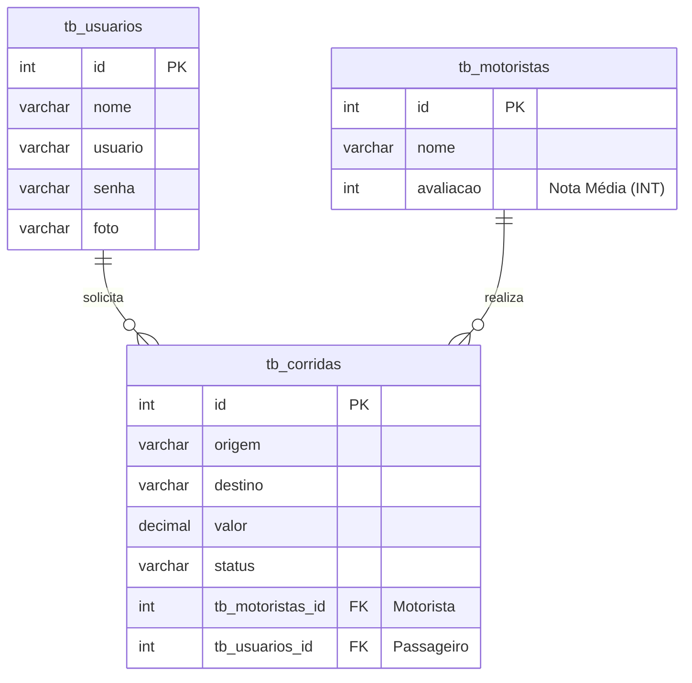

<h1 align="center">Conduzzé 🚗💨</h1>


## Sobre o Projeto

O **Conduzzé** é um projeto didático que simula a arquitetura fundamental de um aplicativo de carona. O nome é moderno, sonoro e remete à **condução** com um toque único e dinâmico.

A essência deste projeto é demonstrar a modelagem de dados e a arquitetura de uma API que gerencia a relação básica de **passageiros**, **motoristas** e o **serviço de Corrida**. O foco é na implementação das operações **CRUD** (*Criar, Ler, Atualizar, Excluir*) dentro de um contexto de mobilidade.

---

## Foco do Sistema

O **Conduzzé** é um **Sistema Central de Transações de Corridas**, com foco em:

* **Gestão de Atores:** Administração de cadastros de **Usuários** (passageiros) e **Motoristas**.
* **Gestão da Corrida:** Controle do ciclo de vida de uma viagem, desde a solicitação até o status final da corrida.
* **Avaliação Simplificada:** Registro de uma nota **média** e **contagem dinâmica** de corridas por motorista (`avaliacao INT`) para fins de demonstração básica de reputação.

---

## Estrutura e Modelagem de Dados

A principal entidade que conecta todo o sistema é a **`tb_corridas`**, que atua como o **Produto** (o serviço transacionado).

### Entidades

| Entidade | Papel | Detalhe Chave |
| :--- | :--- | :--- |
| **`tb_usuarios`** | O Cliente/Passageiro. | Guarda **`usuario`** e **`senha`** para login. |
| **`tb_motoristas`** | O Prestador de Serviço. | Contém o campo **`avaliacao INT`** (a nota média). |
| **`tb_corridas`** | O Serviço/Produto. | Conecta **`tb_usuarios_id`** e **`tb_motoristas_id`**. |

### Diagrama Entidade-Relacionamento (DER)

O diagrama abaixo representa a estrutura exata do nosso banco de dados, com relacionamentos de **Um para Muitos (1:N)** e a `tb_corridas` como o elo central:



---
## Métodos da API (Endpoints)


A API do Conduzzé expõe os seguintes endpoints, organizados por suas entidades, refletindo a estrutura dos seus Controllers em NestJS:


| Entidade | Método | Endpoint | Descrição | Status HTTP |
| :--- | :--- | :--- | :--- | :--- |
| **Motoristas** | `GET` | `/motoristas` | Retorna a lista completa de motoristas. | `200 OK` |
| **Motoristas** | `GET` | `/motoristas/:id` | Retorna os dados de um motorista específico pelo ID. | `200 OK` |
| **Motoristas** | `GET` | `/motoristas/nome/:nome` | Retorna o motorista pelo nome. | `200 OK` |
| **Motoristas** | `POST` | `/motoristas` | Cadastra um novo motorista. | `201 Created` |
| **Motoristas** | `PUT` | `/motoristas` | Atualiza as informações de um motorista existente. | `200 OK` |
| **Motoristas** | `DELETE` | `/motoristas/:id` | Remove um motorista do sistema. | `204 No Content` |
| **Motoristas** | `GET` |	`/motoristas/corridas/contagem/:id` |	Retorna um motorista específico e o número total de corridas realizadas por ele.| `200 OK` |	
| **Usuários** | `GET` | `/usuarios/all` | Retorna a lista completa de usuários (passageiros). | `200 OK` |
| **Usuários** | `GET` | `/usuarios/:id` | Retorna os dados de um usuário específico pelo ID. | `200 OK` |
| **Usuários** | `POST` | `/usuarios/cadastrar` | Cadastra um novo usuário (passageiro). | `201 Created` |
| **Usuários** | `PUT` | `/usuarios/atualizar` | Atualiza as informações de um usuário existente. | `200 OK` |
| **Corridas** | `GET` | `/corridas` | Retorna a lista completa de corridas registradas. | `200 OK` |
| **Corridas** | `GET` | `/corridas/:id` | Retorna os detalhes de uma corrida específica. | `200 OK` |
| **Corridas** | `POST` | `/corridas` | **Solicita/Cadastra** uma nova corrida (o serviço). | `201 Created` |
| **Corridas** | `PUT` | `/corridas` | Atualiza os dados de uma corrida (ex: mudar status). | `200 OK` |
| **Corridas** | `DELETE` | `/corridas/:id` | Remove o registro de uma corrida. | `204 No Content` |

## Tecnologias Usadas

Este projeto foi construído utilizando as seguintes tecnologias principais:

| Tecnologias	| Uso Principal 
| :--- | :--- |
|  Framework	NestJS - Backend |	Construção da API RESTful com arquitetura modular. |
| TypeScript -  Linguagem	 | Garante tipagem estática, maior robustez e manutenibilidade do código. |
|	TypeORM -  Persistência	| Mapeamento Objeto-Relacional para a gestão das entidades. |
|	MySQL -  Banco de Dados|	Armazenamento persistente e relacional dos dados do sistema. |
|Bcrypt -  Segurança		| Hashing criptográfico para proteger as credenciais. |
|	Insomnia  -  Testes API  |	Teste e documentação das requisições HTTP nos endpoints. |


## Como Executar o Projeto  


### Instalar dependências
```bash
npm install
```

#### Executar em modo desenvolvimento
```bash
npm run start:dev
```


